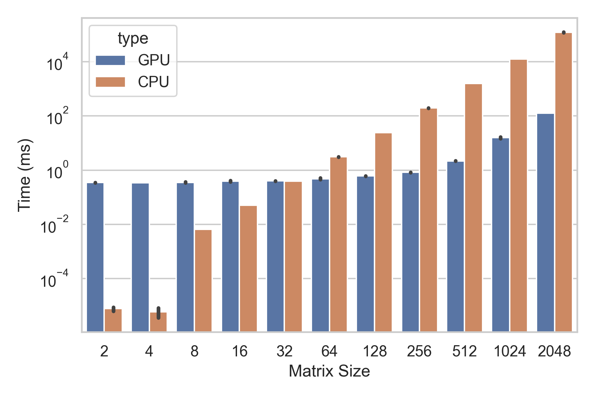

# GopherChina 2023 Talk "Go on GPU"

This repository contains source files for the GopherChina 2023 "Go on GPU" talk.

## Abstract

In the past decade, multi-core heterogeneous computing has gradually become mainstream, forming a pattern where CPUs serve as the scheduling hub and work in conjunction with other specialized processors to handle computational tasks. Among them, thanks to the evolution and improvement of graphics computing technology, GPUs have gradually become an indispensable part of the field of general-purpose computing. Dr. Changkun Ou focuses on the practice of Go language in GPU computing, using a library that supports GPU computing as a background to explain how to interact with various pipelines of Go language and GPUs. The implementation challenges and performance challenges encountered in the practical process will be explored, and finally, an outlook will be given on the application areas within the Go language community based on GPU computing.

## Slides

The slides can be found [here(soon)].

## Source Code

### Example 1: Matrix Multiplication

The code included in this repository demonstrates the performance improvements of using GPU to accelerate the calculation of matrix multiplication.

```go
package gpu

import "changkun.de/x/gogpu/math"

// Mul is a GPU version of math.Mat[T].Mul method and it multiplies
// two matrices m1 and m2 and returns the result.
func Mul[T math.Type](m1, m2 math.Mat[T]) math.Mat[T]
```

To run the demo code:

```
go test -v -run=TestMul
```

To run the benchmarks:

```
go test -v -run=none -bench=BenchmarkMul -timeout=1h | tee bench.txt
```

```
$ benchstat bench.txt
name                  time/op
Mul/GPU(2x2)-8         346µs ± 3%
Mul/CPU(2x2)-8         138ns ± 1%
Mul/GPU(4x4)-8         342µs ± 1%
Mul/CPU(4x4)-8         865ns ± 1%
Mul/GPU(8x8)-8         354µs ± 8%
Mul/CPU(8x8)-8        6.61µs ± 0%
Mul/GPU(16x16)-8       392µs ±11%
Mul/CPU(16x16)-8      50.4µs ± 1%
Mul/GPU(32x32)-8       396µs ± 2%
Mul/CPU(32x32)-8       388µs ± 0%
Mul/GPU(64x64)-8       456µs ± 1%
Mul/CPU(64x64)-8      3.07ms ± 0%
Mul/GPU(128x128)-8     606µs ± 4%
Mul/CPU(128x128)-8    24.3ms ± 0%
Mul/GPU(256x256)-8     829µs ± 2%
Mul/CPU(256x256)-8     194ms ± 0%
Mul/GPU(512x512)-8    2.18ms ± 2%
Mul/CPU(512x512)-8     1.55s ± 0%
Mul/GPU(1024x1024)-8  15.7ms ±15%
Mul/CPU(1024x1024)-8   12.4s ± 0%
Mul/GPU(2048x2048)-8   126ms ± 1%
Mul/CPU(2048x2048)-8    120s ± 3%
```



The benchmark shows that the GPU version of matrix multiplication is ~950x faster than the CPU version with a matrix size of 2048 x 2048.

Note that the code included in this repository is a tidy version that was written in Project [PolyRed](https://github.com/polyred/polyred).

### Example 2: Image Processing

The code included in this repository demonstrates the performance improvements of using GPU to accelerate image processing.

```go
package enhance

// ImageGPU is a GPU version of Image.
func ImageGPU(m *image.RGBA, params Params) *image.RGBA
```

To run the demo code:

```
go test -v -run=TestImageEnhance
```

| Original | Enhanced(CPU) | Enhanced(GPU) |
| -------- | ------------- | ------------- |
|  |  |  |

To run the benchmarks:

```
go test -v -run=none -bench=BenchmarkImageEnhance -timeout=1h | tee bench2.txt
```

```
$ benchstat bench2.txt
name                time/op
ImageEnhance/CPU-8   432ms ± 1%
ImageEnhance/GPU-8  6.39ms ± 6%
```

The benchmark shows that the GPU version of matrix multiplication is ~64x faster than the CPU version

Note that the code included in this repository is a tidy version that was written in Project [Enhance](https://github.com/changkun/enhance).

## License

The slides are licensed under the [CC BY-NC-SA 4.0](https://creativecommons.org/licenses/by-nc-sa/4.0/) license, and the source code is licensed under the [MIT](https://opensource.org/licenses/MIT) license.